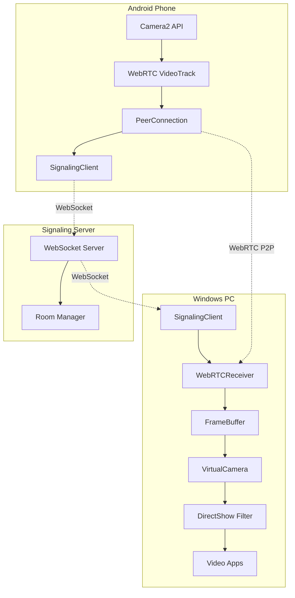

# WebCAMO Architecture

## System Overview

WebCAMO consists of three main components that work together to stream video from an Android phone to Windows applications via a virtual webcam.



---

## Component Details

### 1. Android App (Sender)

| Component | File | Purpose |
|-----------|------|---------|
| **WebRTCClient** | `webrtc/WebRTCClient.kt` | Manages PeerConnection, camera capture, video encoding |
| **SignalingClient** | `signaling/SignalingClient.kt` | WebSocket communication for SDP/ICE exchange |
| **MainActivity** | `ui/MainActivity.kt` | UI, permissions, lifecycle management |
| **CameraStreamService** | `service/CameraStreamService.kt` | Background streaming (future) |

**Key Flow:**
1. User taps "Start Streaming"
2. Camera2 API captures frames
3. WebRTC encodes and creates VideoTrack
4. SignalingClient exchanges SDP offer
5. P2P connection established
6. Video streams directly to Windows

### 2. Windows Desktop (Receiver)

| Component | File | Purpose |
|-----------|------|---------|
| **Application** | `Application.cpp` | Main coordinator, window message loop |
| **SignalingClient** | `SignalingClient.cpp` | WebSocket client for signaling |
| **WebRTCReceiver** | `WebRTCReceiver.cpp` | Handles incoming video stream |
| **FrameBuffer** | `FrameBuffer.cpp` | Thread-safe frame queue |
| **VirtualCamera** | `VirtualCamera.cpp` | Shared memory bridge to DirectShow |
| **SystemTray** | `SystemTray.cpp` | Notification area icon and menu |

**Key Flow:**
1. User connects via tray menu
2. SignalingClient connects to server
3. Receives SDP offer, creates answer
4. WebRTCReceiver receives video frames
5. Frames pushed to FrameBuffer
6. VirtualCamera writes to shared memory
7. DirectShow filter reads and provides to apps

### 3. DirectShow Virtual Camera Filter

| File | Purpose |
|------|---------|
| `VirtualCameraFilter.cpp` | DirectShow source filter |
| `VirtualCameraFilter.def` | DLL exports |

**Registration:**
- Registers as `CLSID_WebCAMOCamera`
- Added to `CLSID_VideoInputDeviceCategory`
- Apps detect it as "WebCAMO Camera"

---

## Data Flow

### Signaling Flow (WebSocket)

```
Android                    Server                     Windows
   │                         │                          │
   ├──────connect────────────►                          │
   │                         │◄─────────connect─────────┤
   │                         │                          │
   │◄──────peer-joined───────┤────────peer-joined──────►│
   │                         │                          │
   ├──────offer (SDP)────────►                          │
   │                         ├──────offer (SDP)────────►│
   │                         │                          │
   │                         │◄─────answer (SDP)────────┤
   │◄─────answer (SDP)───────┤                          │
   │                         │                          │
   ├────ice-candidate────────►                          │
   │                         ├────ice-candidate────────►│
   │                         │                          │
   │                         │◄────ice-candidate────────┤
   │◄────ice-candidate───────┤                          │
   │                         │                          │
   ════════════════════════════════════════════════════
              P2P Connection Established
```

### Video Frame Flow (Windows)

```
┌─────────────────────────────────────────────────────────────┐
│                     WebRTCReceiver                          │
│  ┌──────────┐    ┌───────────┐    ┌──────────────────┐     │
│  │ WebRTC   │───►│VideoSink  │───►│OnVideoFrame()    │     │
│  │ Decoder  │    │Interface  │    │                  │     │
│  └──────────┘    └───────────┘    └────────┬─────────┘     │
└────────────────────────────────────────────┼───────────────┘
                                             │
                                             ▼
┌─────────────────────────────────────────────────────────────┐
│                     FrameBuffer                             │
│  ┌──────────┐    ┌───────────┐    ┌──────────────────┐     │
│  │ Push()   │───►│  Queue    │───►│    Pop()         │     │
│  └──────────┘    │ (3 frames)│    └────────┬─────────┘     │
│                  └───────────┘             │               │
└────────────────────────────────────────────┼───────────────┘
                                             │
                                             ▼
┌─────────────────────────────────────────────────────────────┐
│                    VirtualCamera                            │
│  ┌──────────┐    ┌───────────┐    ┌──────────────────┐     │
│  │FrameLoop │───►│PushFrame()│───►│  Shared Memory   │     │
│  └──────────┘    └───────────┘    │  + SetEvent()    │     │
│                                   └────────┬─────────┘     │
└────────────────────────────────────────────┼───────────────┘
                                             │
                                             ▼
┌─────────────────────────────────────────────────────────────┐
│               DirectShow Filter (DLL)                       │
│  ┌──────────┐    ┌───────────┐    ┌──────────────────┐     │
│  │WaitFor   │───►│Read Shared│───►│  FillBuffer()    │     │
│  │Event()   │    │Memory     │    │  → IMediaSample  │     │
│  └──────────┘    └───────────┘    └────────┬─────────┘     │
└────────────────────────────────────────────┼───────────────┘
                                             │
                                             ▼
                                    ┌─────────────────┐
                                    │   Zoom/Teams/   │
                                    │   OBS/etc.      │
                                    └─────────────────┘
```

---

## Security Considerations

1. **WebRTC Encryption**: All P2P video is DTLS-SRTP encrypted
2. **Local Network**: Signaling server should run on local network
3. **No Cloud Relay**: Video goes directly between devices
4. **Shared Memory**: Only accessible by same-user processes

---

## Performance Optimizations

| Optimization | Implementation |
|--------------|----------------|
| Hardware encoding | VP8/H.264 via device GPU |
| Frame dropping | FrameBuffer drops old frames when full |
| Zero-copy shared memory | Direct memory mapping between processes |
| Async frame signaling | Windows Event objects for notification |

---

## Future Enhancements

- [ ] USB tethering support via ADB tunnel
- [ ] MJPEG fallback for compatibility
- [ ] Audio streaming
- [ ] Multiple camera support
- [ ] Resolution/quality settings UI
- [ ] Auto-discovery via mDNS
